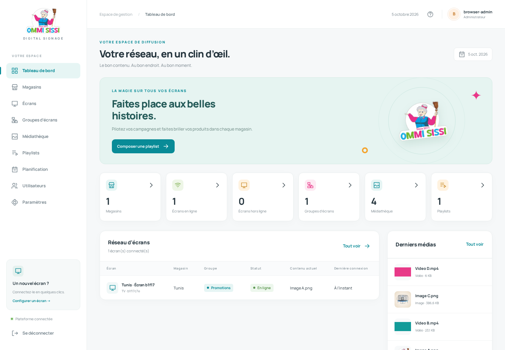
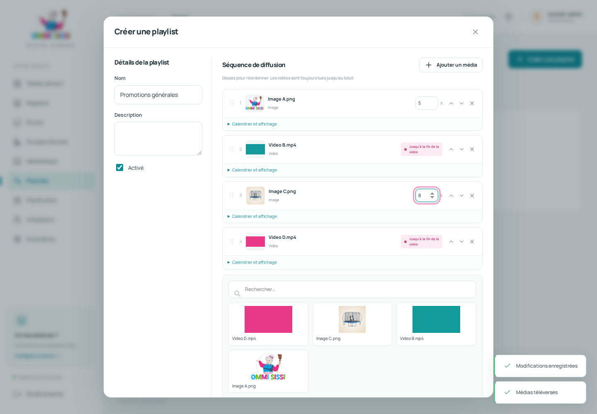
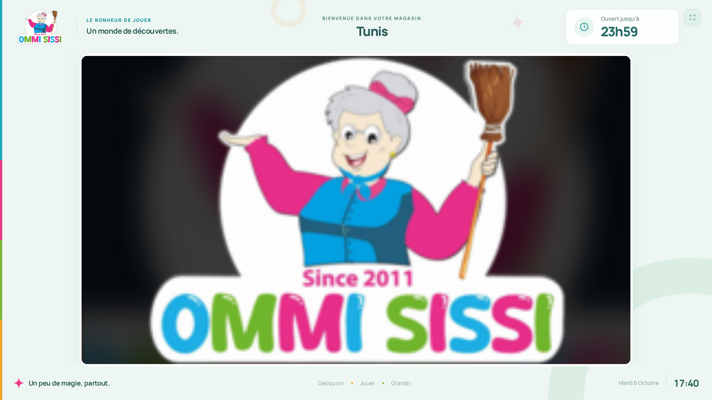

# OMMI SISSI Digital Signage

**Download for CachyOS or Ubuntu:** [Linux installation guide](docs/INSTALL-LINUX.md) · [Download ZIP](https://github.com/ACHRAF012006/ommi-sissi-signage/archive/refs/heads/main.zip) · [Versioned releases](https://github.com/ACHRAF012006/ommi-sissi-signage/releases)

**CachyOS / Arch — install Git, clone, install, and start:**

```bash
sudo pacman -Syu --needed git
git clone https://github.com/ACHRAF012006/ommi-sissi-signage.git
cd ommi-sissi-signage
./install.sh
./start.sh
```

**Ubuntu / Debian — install Git, clone, install, and start:**

```bash
sudo apt-get update
sudo apt-get install -y git
git clone https://github.com/ACHRAF012006/ommi-sissi-signage.git
cd ommi-sissi-signage
./install.sh
./start.sh
```

Install Node.js 24 LTS and npm first. The [Linux guide](docs/INSTALL-LINUX.md) includes prerequisite commands for both distributions. A fresh download starts with an empty database and asks you to create your own administrator account. Linux installation enables startup at boot through systemd by default; sudo may be requested. Use `./install.sh --no-autostart` for manual installation.

Application d’affichage dynamique **autohébergée**, en français, pour piloter les TVs de plusieurs magasins OMMI SISSI. Node.js / Express, SQLite, HTML/CSS/JavaScript natif et Socket.IO. Aucun service cloud, compte externe ni abonnement requis. Le logo et la police sont servis localement.

## Overview

- Deux rôles : un administrateur unique et des utilisateurs. Les utilisateurs gèrent la diffusion et les magasins existants ; la création de magasins, les comptes et les paramètres sont réservés à l’administrateur.
- Administration authentifiée : magasins, horaires hebdomadaires, exceptions, groupes, écrans, médias, playlists, utilisateurs et stockage.
- Groupes partagés entre magasins, playlist générale et substitution par magasin.
- Images avec durée configurable, vidéos lues jusqu’à `ended`, ordre par glisser-déposer ou boutons accessibles, aperçu navigateur.
- Calendrier par média : dates inclusives, créneaux horaires (fin exclusive), plages traversant minuit.
- Accueil `/` avec choix Administration / Écran & affichage, bouton de plein écran dans le coin supérieur droit sur toutes les pages.
- Transitions par glissement fluide de droite à gauche (700 ms), sans coupure de vidéo ; mode réduit sans animation lorsque le navigateur demande moins de mouvement.
- Surface média toujours au format **16:9**, centrée dans un lecteur plein viewport avec cadre de marque permanent : logo, magasin, heure de fermeture/prochaine ouverture, date et horloge dans le fuseau du magasin ; modes `contain`/`cover`, arrière-plan flouté des images, préchargement d’un seul média suivant.
- Inscription TV avec UUID et jeton individuel, heartbeat toutes les 25 secondes, hors ligne après 90 secondes par défaut.
- Synchronisation par rooms Socket.IO. Les modifications attendent la fin du média en cours. La désactivation et la fermeture du magasin suspendent immédiatement la diffusion. La commande explicite « Redémarrer » recharge immédiatement le lecteur.
- Reconnexion automatique, dernière configuration et catalogue conservés localement ; les médias déjà présents dans le cache HTTP peuvent continuer pendant une coupure. La disponibilité hors ligne d’une vidéo entière dépend du cache et de l’espace du navigateur : **ce n’est pas un téléchargement garanti de toute la bibliothèque**.
- SQLite en WAL, migrations versionnées, requêtes paramétrées, sessions SQLite persistantes, mots de passe bcrypt (coût 12), CSRF, limitation des connexions, Helmet et contrôle binaire des uploads.

## Screenshots

Captures issues des tests Chromium, avec données de test :






Autres captures : [connexion](docs/screenshots/login.png), [médiathèque](docs/screenshots/media.png), [configuration TV](docs/screenshots/tv-setup.png), [écran fermé](docs/screenshots/closed-screen.png), [mobile](docs/screenshots/mobile.png).

## Requirements

- **Node.js >= 22.12**, version **24 LTS recommandée**, avec npm.
- Windows 10/11, CachyOS, Arch, Debian ou Ubuntu. Les installateurs vérifient la version ; les paquets anciens de Debian/Ubuntu peuvent nécessiter l’installation de Node.js LTS depuis [nodejs.org](https://nodejs.org).
- Navigateur moderne : Chrome/Chromium ou Edge recommandés pour les TVs. MP4 H.264/AAC est le format conseillé. L’extension MP4 seule ne garantit pas la compatibilité du codec ; WebM dépend aussi du navigateur.
- FFmpeg/ffprobe **facultatifs en exploitation**, pour durée/résolution et miniature vidéo. Sans eux, la lecture fonctionne et les métadonnées indisponibles sont indiquées. FFmpeg est nécessaire pour les tests vidéo navigateur.
- Prévoir l’espace des médias, sauvegardes et caches. SQLite doit résider sur un disque **local**, pas sur un partage SMB/NFS.

## CachyOS installation

Dans le dossier du projet, en tant qu’utilisateur normal :

```bash
chmod +x install.sh start.sh
./install.sh
```

L’installateur détecte CachyOS/Arch et propose `pacman` si Node.js ou npm manque. Il installe les dépendances, prépare les dossiers, crée `.env` avec un secret aléatoire, initialise SQLite, propose la création du premier compte puis active le démarrage au boot via systemd par défaut. Il peut demander le mot de passe sudo. `./install.sh --no-autostart` ignore la configuration du service et conserve son état existant.

Installation manuelle du runtime, si nécessaire :

```bash
sudo pacman -Syu --needed nodejs-lts-krypton npm base-devel python
# Facultatif pour les miniatures vidéo :
sudo pacman -S --needed ffmpeg
./install.sh
```

Si votre miroir ne propose pas encore `nodejs-lts-krypton`, installez Node.js 24 LTS depuis nodejs.org ou un gestionnaire de versions. Un runtime local utilisé pendant le développement ne remplace pas l’installation de Node.js sur votre ordinateur.

## Arch Linux installation

Même procédure que CachyOS : `./install.sh`. Le script utilise `pacman -Syu`, afin d’éviter une mise à jour partielle d’Arch. Les outils de compilation sont utiles si aucun binaire précompilé de better-sqlite3 n’existe pour votre architecture.

## Debian installation

```bash
chmod +x install.sh start.sh
./install.sh
```

Le script détecte Debian et propose `apt-get install nodejs npm build-essential python3`. Si le dépôt fournit Node.js < 22.12, le script s’arrête avec une explication : installez Node.js 24 LTS, vérifiez `node --version` et `npm --version`, puis relancez. FFmpeg : `sudo apt-get install ffmpeg`.

## Ubuntu installation

Suivez le [guide Ubuntu avec Node.js 24 LTS](docs/INSTALL-LINUX.md#ubuntu--debian), puis lancez `./install.sh`. L’installateur utilise `npm ci --omit=dev` et ne remplace jamais `.env` ni une base existante.

## Windows installation

1. Copiez le dossier sur un disque local, par exemple `C:\OmmiSissi`.
2. Installez Node.js 24 LTS avec npm depuis nodejs.org, ou laissez `install.ps1` proposer `winget`.
3. Ouvrez PowerShell dans le dossier :

```powershell
powershell -ExecutionPolicy Bypass -File .\install.ps1
.\start.ps1
```

Si npm est bloqué par la politique PowerShell, utilisez `npm.cmd`. FFmpeg peut être installé séparément et ajouté au PATH. En cas de compilation native sur une architecture inhabituelle, installez Python et les outils C++ de Visual Studio Build Tools.

## Development mode

```bash
npm install
node scripts/setup-env.js
npm run init-db
npm run create-admin
npm run dev
```

Sur Arch/CachyOS, si une installation système de libvips force la compilation de Sharp :

```bash
SHARP_IGNORE_GLOBAL_LIBVIPS=1 npm install
```

Les installateurs le règlent automatiquement. `npm run dev` utilise le mode watch natif de Node.js. Aucun bundler frontend.

Données de démonstration facultatives :

```bash
npm run seed
```

Crée Tunis, Promotions/Piscines/Vélos, une playlist et importe les cinq images `img/` si présentes. La commande est idempotente et refusée en production. Elle ne crée aucun administrateur. Le magasin de démonstration désactive l’écran fermé pour permettre l’essai à toute heure.

## Production mode

Renseignez `.env` :

```dotenv
NODE_ENV=production
HOST=0.0.0.0
PORT=3000
SESSION_SECRET=UN_SECRET_ALEATOIRE_DE_32_CARACTERES_MINIMUM
DATABASE_PATH=./data/ommisissi.db
UPLOAD_PATH=./uploads
TIMEZONE=Africa/Tunis
MAX_UPLOAD_SIZE_MB=1000
TRUST_PROXY=false
COOKIE_SECURE=false
ALLOW_DISPLAY_REGISTRATION=true
OFFLINE_TIMEOUT_SECONDS=90
```

Générez le secret avec `node -e "console.log(require('node:crypto').randomBytes(48).toString('hex'))"`. L’installateur le génère déjà. Ne partagez pas `.env`. Le serveur refuse un secret manquant, court ou `CHANGE_ME` en production. En développement, un secret persistant est généré dans `data/.session-secret` si nécessaire.

```bash
npm ci --omit=dev
npm start
# ou ./start.sh / .\start.ps1
```

Un seul processus Node.js est recommandé pour SQLite et les rooms Socket.IO locales. Le processus ne doit pas tourner en root/Administrateur.

### Linux : démarrer, arrêter et basculer le démarrage au boot

Scripts fournis pour CachyOS, Arch, Debian et Ubuntu avec systemd :

`./install.sh` active automatiquement le démarrage au boot. Le serveur sera lancé au prochain boot ; `./start.sh` le démarre immédiatement. Sur un système sans systemd ou pour un lancement manuel, utilisez `./install.sh --no-autostart`. Si la configuration du service échoue, l’installateur s’arrête avec une erreur.

```bash
./start.sh                           # Démarre cette installation
./stop.sh                            # Arrêt de cette installation
npm run stop                         # Équivalent Linux
./toggle-autostart.sh                 # Active/désactive le démarrage au boot
./toggle-autostart.sh on              # Active explicitement
./toggle-autostart.sh off             # Désactive explicitement
./toggle-autostart.sh status          # Affiche l’état, sans modification
./toggle-autostart.sh print           # Affiche le service proposé
npm run autostart -- status           # Équivalent via npm
```

`start.sh` utilise le service systemd de cette installation lorsqu’il est configuré. Sinon, il lance Node.js au premier plan : gardez le terminal ouvert. Il détecte un serveur déjà lancé dans ce dossier et évite une seconde instance. Vous pouvez lancer les scripts depuis un autre dossier en utilisant leur chemin complet.

L’activation installe `/etc/systemd/system/ommi-sissi.service` si nécessaire, avec les chemins absolus de cette installation et de Node.js, puis active son lancement au prochain boot. Le service utilise votre compte utilisateur non-root et la configuration `.env` du projet. Les chemins avec des espaces sont pris en charge. Les opérations système appellent `sudo` si nécessaire ; lancez les scripts depuis un terminal. Aucun package global n’est requis.

Le basculement du démarrage au boot ne démarre ni n’arrête le serveur en cours. Pour passer du lancement manuel au service immédiatement :

```bash
./toggle-autostart.sh on
./stop.sh
./start.sh
sudo systemctl status ommi-sissi.service
sudo journalctl -u ommi-sissi.service -f
```

`stop.sh` arrête le service système/utilisateur s’il appartient à ce dossier, les applications PM2 de ce dossier si un daemon PM2 est actif, puis les processus Node du serveur lancé par `start.sh`, `npm start` ou `npm run dev`. Il envoie SIGTERM et attend jusqu’à 30 secondes ; `./stop.sh --force` force l’arrêt d’un processus resté bloqué. Il laisse les autres projets et l’état de démarrage au boot inchangés. Un service déjà installé pour un autre dossier n’est jamais remplacé par le toggle. Après déplacement du projet, adaptez ou réinstallez le service.

Ces commandes de boot gèrent le service systemd OMMI SISSI ; un démarrage PM2 configuré séparément reste géré par PM2. `./stop.sh` ne modifie pas sa sauvegarde de démarrage.

### Linux : service systemd facultatif

Adaptez [deployment/ommi-sissi.service](deployment/ommi-sissi.service) : utilisateur dédié, `WorkingDirectory`, chemin de Node.js et `ReadWritePaths`. Exemple dans `/opt/ommi-sissi-signage` :

```bash
sudo useradd --system --home /opt/ommi-sissi-signage --shell /usr/sbin/nologin ommisissi
sudo chown -R ommisissi:ommisissi /opt/ommi-sissi-signage
sudo cp deployment/ommi-sissi.service /etc/systemd/system/
sudo systemctl daemon-reload
sudo systemctl enable --now ommi-sissi
sudo journalctl -u ommi-sissi -f
```

Si Node.js est installé avec un gestionnaire de versions, indiquez son chemin absolu. `ProtectHome=true` nécessite un projet hors de `/home` ; adaptez le service si vous choisissez un autre emplacement.

### PM2 facultatif

```bash
npm install -g pm2
pm2 start ecosystem.config.cjs
pm2 save
pm2 startup
```

PM2 n’est pas requis. Gardez `instances: 1`.

### Windows : lancement au démarrage

Dans le Planificateur de tâches, créez une tâche au démarrage, exécutée par le compte qui possède le projet, même sans session ouverte. Programme : chemin absolu de `node.exe`. Argument : `"C:\OmmiSissi\server.js"`. Dossier de démarrage : `C:\OmmiSissi`. Activez la relance après échec et désactivez la limite de durée. Le compte doit avoir lecture du code et écriture dans `data`, `uploads`, `logs`, `backups`. Une tâche au démarrage évite de dépendre d’une fenêtre PowerShell ouverte.

### HTTPS / reverse proxy

Nginx ou Caddy peut terminer HTTPS et proxyfier HTTP + WebSocket vers le serveur. Le modèle `.env.example` désactive la confiance proxy (`TRUST_PROXY=false`). Pour un proxy de confiance, indiquez son adresse dans `.env`, par exemple `TRUST_PROXY=10.2.2.2`. Node.js accepte ses en-têtes `X-Forwarded-Host`, `X-Forwarded-Proto` et `X-Forwarded-For`, notamment pour les sessions, les contrôles CSRF et Socket.IO. Les en-têtes transmis par les autres clients ne sont pas utilisés. Pour plusieurs proxys, utilisez une liste d’adresses IP/CIDR séparées par des virgules. La valeur `false` désactive cette confiance ; `true` reste compatible avec les anciennes installations (un saut de proxy). Avec HTTPS, réglez aussi `COOKIE_SECURE=true`. Pour un accès LAN direct en HTTP, gardez `COOKIE_SECURE=false`, sinon le navigateur ne renvoie pas les cookies de session. N’activez pas `TRUST_PROXY` sur un serveur directement exposé avec des en-têtes proxy non fiables.

L’adresse configurée doit être celle que Node.js voit comme pair réseau ; adaptez-la si un conteneur ou un autre relais la modifie. Redémarrez le serveur après modification de `.env`.

Les limites du proxy doivent couvrir `MAX_UPLOAD_SIZE_MB` et la durée d’un upload. Exemple Nginx :

```nginx
location / {
    proxy_pass http://127.0.0.1:3000;
    proxy_http_version 1.1;
    proxy_set_header Host $http_host;
    proxy_set_header X-Forwarded-Host $http_host;
    proxy_set_header X-Forwarded-Proto $scheme;
    proxy_set_header X-Forwarded-For $proxy_add_x_forwarded_for;
    proxy_set_header Upgrade $http_upgrade;
    proxy_set_header Connection "upgrade";
    client_max_body_size 1000m;
    proxy_read_timeout 300s;
}
```

L’inscription publique est conçue pour un LAN de confiance. Après connexion des TVs, mettez `ALLOW_DISPLAY_REGISTRATION=false` et redémarrez. Les TVs déjà inscrites continuent de fonctionner ; une reconfiguration par setup nécessite de réactiver temporairement l’inscription. La modification par l’administrateur ne l’exige pas. L’inscription initiale ne doit pas être ouverte sans contrôle réseau sur Internet.

## Creating first administrator

```bash
npm run create-admin
```

Le CLI demande identifiant, mot de passe masqué et confirmation. Minimum 12 caractères. **Aucun compte n’est créé automatiquement au démarrage**. Un seul compte administrateur est autorisé. Relancez avec son identifiant pour réinitialiser son mot de passe après confirmation ; ses sessions sont révoquées. Le CLI refuse de créer un second administrateur. Un terminal interactif est requis. Les autres comptes sont créés depuis Utilisateurs et reçoivent automatiquement le rôle Utilisateur.

## Resetting the administrator

Depuis le dossier de l’application, sur Linux ou Windows :

```bash
npm run reset-admin
# Équivalent : node scripts/reset-admin.js
```

Cette commande de récupération crée l’administrateur s’il n’existe pas, ou renomme l’administrateur unique existant en **admin**, puis définit son mot de passe à **123456789123**. Elle conserve son ID, les autres comptes et les données des magasins, médias et playlists. Les anciennes sessions administrateur sont révoquées. La commande est répétable et n’est jamais exécutée automatiquement au démarrage ou par les installateurs.

Si un autre compte utilisateur porte déjà le nom `admin`, la commande s’arrête sans modifier les comptes ; renommez cet utilisateur avant de réessayer. Connectez-vous ensuite sur `/admin/login` avec `admin` et le mot de passe ci-dessus.

## Accessing admin panel

- Accueil local : **http://localhost:3000/**, puis Administration ou Écran & affichage.
- Administration locale : **http://localhost:3000/admin**.
- Connexion : **http://localhost:3000/admin/login**.
- Depuis un PC du LAN : `http://IP-DU-SERVEUR:3000/admin`.
- Le tableau de bord montre compteurs réels, état des écrans, contenu déclaré par heartbeat et derniers médias.
- Une session dure huit heures. Les écritures utilisent le jeton CSRF récupéré à la connexion. Logout détruit la session côté serveur.

## User roles and permissions

L’administrateur unique conserve tous les droits. Depuis **Utilisateurs**, il crée, modifie ou supprime les autres comptes ; ceux-ci utilisent la même page de connexion et apparaissent comme **Utilisateur**. La création d’un second administrateur, sa suppression et sa rétrogradation sont bloquées par l’API et par SQLite.

| Fonction | Administrateur | Utilisateur |
|---|---|---|
| Tableau de bord, écrans, groupes, médias, playlists, planification | Oui | Oui |
| Consulter, modifier ou supprimer les magasins existants et leurs horaires | Oui | Oui |
| Créer un magasin | Oui | Non |
| Gérer les comptes utilisateurs | Oui | Non |
| Accéder aux paramètres | Oui | Non |

Les contrôles indisponibles sont masqués. Les requêtes API directes sont également refusées avec HTTP 403. Les utilisateurs reçoivent les mises à jour Socket.IO ; supprimer un compte ou modifier son mot de passe révoque ses sessions et ses connexions temps réel.

Au prochain démarrage, la migration conserve le plus ancien administrateur (plus petit ID), transforme les autres comptes administrateurs en utilisateurs et préserve identifiants, mots de passe et données métier. Les sessions des comptes dont le rôle change sont révoquées. Une installation sans administrateur doit exécuter `npm run create-admin`.

## Connecting a TV

1. Sur la TV, ouvrez **http://IP-DU-SERVEUR:3000/display** dans Chrome/Edge.
2. Choisissez magasin et groupe.
3. Cliquez « Démarrer l’affichage » ou « Démarrer en plein écran ».
4. Les rechargements retrouvent automatiquement la configuration. Renommez la TV dans Écrans.

`/display/setup` ou **Ctrl + Maj + S** ouvre la configuration. **Ctrl + Maj + D** affiche/masque les diagnostics (magasin, groupe, playlist, média, connexion, serveur, résolution, dernière synchronisation). Pendant la diffusion, le cadre affiche le logo, le magasin, la fermeture prévue et l’heure locale ; en dehors des horaires, il affiche la prochaine ouverture. Les exceptions et les ouvertures traversant minuit sont prises en compte. La surface de diffusion garde le format **16:9** et utilise la plus grande taille possible entre le bandeau et le pied de page, y compris sur un écran portrait. Les médias conservent leur proportion. Le bouton en haut à droite permet d’entrer/sortir du plein écran ; Échap permet aussi d’en sortir. Cette API nécessite un clic et peut quitter le plein écran pendant une navigation vers une autre page. La touche F11 reste disponible sur ordinateur. Le lecteur remplit toujours le viewport sans défilement. Les TVs sur HTTP LAN utilisent un UUID via `crypto.getRandomValues` lorsque `crypto.randomUUID` n’est pas disponible.

Gardez le navigateur actif et désactivez la mise en veille de la TV/du PC. Les navigateurs peuvent suspendre les onglets en arrière-plan ; utilisez un onglet dédié ou le mode kiosque. Les vidéos sont muettes pour respecter l’autoplay.

## Creating stores

Magasins → Ajouter un magasin. Renseignez un code unique, nom, adresse, fuseau et horaires. Dimanche fermé par défaut. « Copier lundi aux jours ouvrés » copie lundi vers mardi–vendredi. Des horaires où fermeture < ouverture traversent minuit. Pour une journée fermée, cochez « Fermé ». Une fermeture exceptionnelle datée prend priorité, y compris sur une ouverture de la veille traversant minuit. L’option « Afficher l’écran de fermeture » est indépendante de l’activation du magasin.

## Creating groups

Groupes d’écrans → Créer un groupe. Nommez le canal et choisissez sa playlist. Plusieurs TVs de plusieurs magasins peuvent partager ce canal. Elles ont le même contenu, mais **ne sont pas verrouillées sur la même frame** : chaque TV commence sa boucle indépendamment.

## Uploading media

Médiathèque → glissez des fichiers ou Parcourir. Jusqu’à dix fichiers par envoi. La progression montre l’envoi, puis le traitement des miniatures. Le contenu binaire doit correspondre au MIME annoncé ; SVG et HTML ne sont pas acceptés. Les fichiers sont écrits sur disque et reçoivent un nom UUID ; aucune vidéo entière n’est chargée en RAM côté serveur. La taille maximale est configurable. La limite d’image est de 100 millions de pixels. Les images et GIF conservent leur original ; miniatures statiques séparées.

Cliquez une carte pour prévisualiser. Filtrez images/vidéos, cherchez par titre, renommez ou supprimez. Un média utilisé exige une deuxième confirmation explicite pour le retirer de toutes les playlists. Les URLs sont immuables et cacheables un an ; remplacer un fichier consiste à téléverser un nouveau média puis remplacer ses occurrences.

## Creating playlists

Playlists → Créer → Ajouter un média. Un même média peut apparaître plusieurs fois. Glissez pour ordonner, ou utilisez les flèches haut/bas. Réglez les images de 1 à 3600 secondes (8 par défaut). Les vidéos affichent « Jusqu’à la fin de la vidéo », sans durée de coupure.

Dépliez « Calendrier et affichage » pour activation, dates, heures et contain/cover. Les dates de début/fin sont inclusives. Les deux heures quotidiennes doivent être renseignées ensemble ; l’heure de fin est exclusive. Sans restriction, l’élément est toujours éligible. La désactivation de la playlist ou de tous ses éléments affiche « Contenu bientôt disponible ». L’aperçu ouvre un lecteur séparé, exige une session administrateur ou utilisateur, respecte les calendriers et ignore les horaires du magasin.

## Assigning playlist to TVs

1. Assignez la playlist au groupe.
2. Assignez les TVs à ce groupe dans Écrans ou pendant setup.
3. Planification permet une **substitution magasin + groupe**. Choisir « Utiliser la playlist du groupe » retire cette substitution.

Les changements se synchronisent sans recharge manuelle. Les nouvelles playlists sont appliquées après l’image ou vidéo courante. Une panne réelle de chargement/lecture peut provoquer un saut : 45 s de limite de chargement, 60 s sans progression pour une vidéo, puis saut après 1,5 s. Ces délais mesurent une panne, pas la durée totale de la vidéo.

## Opening hours

Les décisions horaires utilisent le fuseau IANA du magasin (`Africa/Tunis` par défaut) et l’heure serveur synchronisée. Les TVs reevaluent les horaires toutes les cinq secondes ; elles interrogent aussi le serveur toutes les 25 secondes, même si Socket.IO est indisponible. À l’ouverture, la publicité reprend automatiquement. Pour tester lundi 09:00–20:00, l’heure locale 15:00 est ouverte, 22:00 est fermée. Les tests couvrent ces cas, les dimanches, exceptions et horaires de nuit.

## Backups

```bash
npm run backup
```

Crée `backups/ommi-sissi-backup-<date-UTC>.zip`, contenant :

- Une copie SQLite cohérente via l’API de backup (WAL inclus), sous `data/ommisissi.db`.
- Les médias et miniatures référencés par cette copie.
- `.env.example`, paramètres non secrets et instructions de restauration.

**Exclus :** `.env`, secret de session de développement, sessions actives, logs et fichiers temporaires. Les comptes et leurs **hachages** de mots de passe, ainsi que les hachages des jetons TV, sont inclus afin de restaurer les identités. Traitez donc les ZIP comme des données confidentielles. Conservez `.env` séparément et protégez ses droits.

Un verrou temporaire `.backup-lock` empêche les mutations administratives pendant l’archive pour éviter qu’un média référencé soit supprimé au milieu de la copie. Les écrans continuent leur lecture et leurs heartbeats. N’exécutez pas de nettoyage externe de `uploads` en même temps. Après arrêt brutal du CLI, vérifiez qu’aucune sauvegarde ne tourne avant de supprimer manuellement le verrou. Prévoir l’espace disque des ZIP et les transférer hors du PC.

### Restore

1. Arrêtez Node.js/systemd/PM2/la tâche Windows.
2. Conservez une copie de l’état actuel avant remplacement.
3. Décompressez l’archive dans un dossier temporaire.
4. Remplacez la base destination par `data/ommisissi.db` de l’archive. Si `DATABASE_PATH` est personnalisé, utilisez ce chemin destination. **Retirez les anciens fichiers `-wal` et `-shm` après arrêt du serveur et avant le remplacement.**
5. Remplacez `uploads` par les médias de l’archive (ou le chemin `UPLOAD_PATH` personnalisé). Créez `uploads/tmp` si manquant.
6. Restaurez votre `.env` séparé ou créez-le avec un nouveau secret ; réglez les chemins/permissions.
7. Lancez `npm run init-db`, puis le serveur. Les sessions actives sont volontairement perdues ; reconnectez-vous.

## Database location

Par défaut : `data/ommisissi.db` plus les fichiers WAL/SHM gérés par SQLite. `DATABASE_PATH` accepte un chemin relatif au projet ou absolu. Les utilisateurs, magasins, playlists, horaires, groupes, substitutions, inscriptions TV, réglages et sessions résident dans cette base. Les migrations sont appliquées transactionnellement une seule fois. Les nouveaux scripts SQL se placent dans `database/migrations/` avec un numéro unique > 1 ; ne modifiez pas un numéro déjà appliqué.

## Media location

`uploads/images`, `uploads/videos`, `uploads/thumbnails`. `uploads/tmp` est réservé aux téléversements et n’est pas servi en HTTP. `UPLOAD_PATH` permet de déplacer cette racine. Les originaux du projet `img/` servent uniquement à la démo. Les logs quotidiens résident dans `logs/` ; archivez/nettoyez périodiquement les anciens logs selon votre politique.

## Moving application to another computer

1. Faites `npm run backup`, puis arrêtez l’ancien serveur.
2. Copiez le code, `package.json`, `package-lock.json`, **data/**, **uploads/** et **.env** sur le nouveau PC. Ne copiez pas `node_modules` entre OS/architectures.
3. Installez Node.js 24 LTS et lancez l’installateur. Il conserve données et configuration.
4. Adaptez `.env` si les anciens chemins sont absolus. Les chemins relatifs par défaut fonctionnent sans modification.
5. Démarrez, autorisez le port dans le pare-feu, puis vérifiez administration et TV.
6. Si l’IP/adresse serveur change, ouvrez la nouvelle adresse sur chaque TV. Le localStorage est lié à l’origine ; une nouvelle origine exige une nouvelle inscription. Pour préserver les identités, gardez le même nom DNS et port.

Pour une copie directe de SQLite, copiez `data/` **serveur arrêté** ; ne copiez pas seulement le `.db` pendant l’activité. Pour une sauvegarde en service, utilisez le CLI fourni.

## Updating application

Sauvegardez avant mise à jour. Arrêtez le service, remplacez seulement le code, gardez `.env`, `data`, `uploads`, puis :

```bash
npm ci --omit=dev
npm run init-db
npm start
```

Ne remplacez jamais les données avec celles d’une autre installation. Après changement de code frontend, rechargez une TV ou utilisez la commande Redémarrer. Les pages HTML ne sont pas mises en cache. Les URLs des modules JavaScript et du CSS changent avec le contenu du frontend ; les imports relatifs suivent la même version. Un rechargement normal récupère donc une interface cohérente.

## Testing

Résultats de livraison : [docs/VERIFICATION.md](docs/VERIFICATION.md).

```bash
npm install
npm run init-db
npm test
# Tests navigateur facultatifs (FFmpeg et Chromium requis) :
npx playwright install chromium
npm run test:browser
# Rôles, formulaires utilisateur et restrictions d’accès
npm run test:roles-browser
# Régression ciblée : connexion avec ancien JavaScript en cache
npm run test:admin-browser
# Accueil, navigation, plein écran et responsive
npm run test:landing-browser
# Glissement des médias, nettoyage des couches et mode sans animation
npm run test:player-transition
# Cadre TV 16:9, vidéo réelle, horaires et résolutions 720p–4K
npm run test:player-frame
```

Les tests Node utilisent des bases SQLite temporaires séparées, couvrent les scripts Linux (processus isolés et gestionnaire de services simulé), migration des rôles, administrateur unique, permissions utilisateurs, révocation des accès, accueil, confiance proxy, origine HTTP/WebSocket, géométrie 16:9, auth/CSRF, magasins/groupes, playlist, validation d’upload, suppression protégée, Range, horaires, calendrier, moteur et rooms Socket.IO. Le scénario de lecture vérifie **5 / 97 / 8 / 20 secondes**, sans minuteur vidéo.

Les essais Chromium créent leur propre base et dossier upload, exercent les vrais formulaires, upload multiple, éditeur, glisser-déposer, setup TV et lisent **réellement** les vidéos de 97 et 20 secondes. Ils vérifient l’application différée d’une mise à jour, la fermeture/reprise, heartbeat, mémoire de configuration, routes, mobile et erreurs console. Durée d’environ trois minutes ; les captures sont écrites dans `docs/screenshots/`. Les tests ne créent aucun compte dans la base d’exploitation.

## Architecture and API

```text
app.js / server.js       composition HTTP et démarrage
config/                  configuration portable
 database/               schéma, migrations et connexion SQLite
middleware/              auth, session, CSRF et upload
routes/                  auth, API, administration et écran
services/                playlists, calendriers, realtime et logs
public/admin/            pages HTML protégées
public/display/          setup et lecteur
public/js/               composants, traductions fr, moteur et rendu
public/css/              identité visuelle et responsive
scripts/                 init, compte, démo, sauvegarde
 tests/                  tests unitaires, API, socket et navigateur
 deployment/             service Linux facultatif
```

Réponses API : `{ "success": true, "data": ... }` ; erreur `{ "success": false, "error": { "code": "…", "message": "…", "details": … } }`. Les erreurs serveur ne révèlent pas leurs traces au client.

- `/auth/session` → CSRF + utilisateur ; `POST /auth/login`, `POST /auth/logout`.
- `/api/stores`, `/api/groups`, `/api/media`, `/api/playlists`, `/api/displays`, `/api/users` → GET/POST/PUT/DELETE selon la ressource. Écrans créés uniquement via inscription.
- `GET /api/playlists/:id`, `GET /api/playlists/:id/preview`, `GET/PUT /api/overrides`, `GET/PUT /api/settings`, `GET /api/dashboard`.
- `POST /api/media` multipart champ `files` (1–10). Suppression forcée d’associations via `?force=true` après confirmation UI.
- `POST /api/displays/:id/reload` et `/refresh`.
- Public : `GET /api/display/setup`, `POST /api/display/register` (LAN).
- TV authentifiée par `Authorization: Bearer <jeton>` : `GET /api/display/:uuid/playlist`, `POST /api/display/:uuid/heartbeat`.
- Médias : `/media/images/:uuid.ext`, `/media/videos/:uuid.ext`, `/media/thumbnails/:uuid.ext`. Express sert les Range et cache immuable ; les noms ne viennent jamais du chemin original fourni par l’utilisateur.

Sockets : `display:register`, `display:heartbeat`, `display:online`, `display:offline`, `display:error`, `display:deleted`, `display:reload`, `playlist:updated`, `group:updated`, `store:schedule-updated`, `data:updated`. Rooms `admin`, `store:<id>`, `group:<id>`, `display:<id>`. Auth socket par session admin ou UUID + jeton TV. Le heartbeat pilote la présence ; un TCP connecté n’est pas suffisant pour être « En ligne ».

Les copies principales sont centralisées dans `public/js/i18n.js`, avec `t(key)` ; les formulaires utilisent des composants communs. Les pages HTML ont actuellement leur texte français. Pour ajouter une langue, ajoutez un catalogue et appliquez sa sélection aux templates HTML. Aucune dépendance framework frontend.

## Troubleshooting

- **Node/npm introuvable** : installez Node.js LTS, rouvrez le terminal ; `node --version`, `npm --version`.
- **SESSION_SECRET invalide** : utilisez un secret aléatoire >= 32 caractères et redémarrez. Le CLI `setup-env.js` conserve un `.env` existant.
- **Tableau de bord vide après une mise à jour** : redémarrez le serveur et rechargez la page. Les modules utilisent maintenant une version commune pour éviter les mélanges de fichiers en cache ; un échec de chargement affiche un bouton de récupération.
- **Connexion impossible / CSRF** : rechargez la page. Vérifiez cookies, hostname constant et `COOKIE_SECURE` (false pour HTTP). Mot de passe oublié : `npm run create-admin` avec l’identifiant existant, ou `npm run reset-admin` pour retrouver `admin` avec le mot de passe de récupération documenté.
- **TV inaccessible** : vérifiez même LAN, IP serveur, `HOST=0.0.0.0`, port 3000 autorisé. Utilisez l’IP du serveur sur une TV, jamais localhost.
- **Aucun contenu** : groupe/playlist activés, playlist affectée, items activés et calendrier valide. Diagnostics Ctrl + Maj + D.
- **Écran fermé** : vérifiez heure serveur, fuseau magasin, jour/exception et option d’écran fermé. Un magasin désactivé affiche un écran désactivé.
- **Vidéo non lue** : testez MP4 H.264 dans le navigateur TV ; vérifiez décodage, taille, réseau, fichier corrompu. Les codecs HEVC peuvent manquer. La détection MIME n’est pas une garantie de décodage sur tous les appareils.
- **Pas de miniature vidéo** : installez FFmpeg/ffprobe et ajoutez-les au PATH, puis téléversez de nouveau. Les erreurs de métadonnées facultatives ne bloquent pas un MP4 valide.
- **Upload échoué** : taille `.env`, limite reverse proxy, espace/droits disque, signature/MIME cohérents ; dix fichiers maximum. Un fichier invalide annule tout le lot.
- **better-sqlite3 ne s’installe pas** : Node.js LTS pris en charge et outils C++/Python si compilation nécessaire. Ne réutilisez pas node_modules copié d’un autre OS.
- **Socket déconnecté** : vérifier proxy WebSocket ; la synchronisation HTTP périodique continue et la reconnexion est automatique.
- **403 inscription TV** : vérifiez `ALLOW_DISPLAY_REGISTRATION`, appareil déjà inscrit avec ancien jeton. La suppression de l’inscription serveur demande un nouveau setup.
- **Échec de backup / verrou** : espace disque, fichiers médias présents, droits ; retirez `.backup-lock` seulement si aucun backup n’est actif.
- **Erreur serveur** : consulter `logs/AAAA-MM-JJ.log` et journal du service. Aucun mot de passe/secret n’est journalisé.

Le code et les scripts sont portables ; les installateurs Windows/systemd doivent être exercés sur leur OS cible avant déploiement définitif. Les tests de cette livraison sont exécutés sur Linux avec Chromium.
